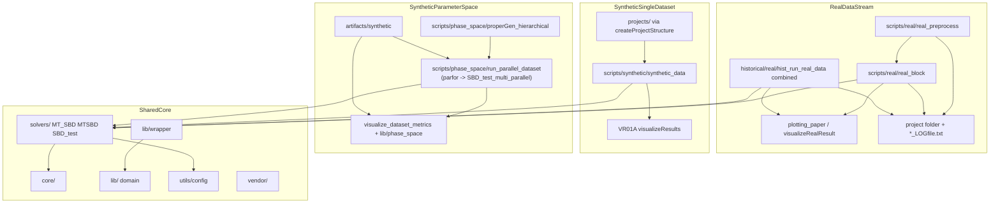

# Repository Structure DAG

Living DAG of functional streams and shared core.
Keep in sync with [`REPO_STRUCTURE.md`](REPO_STRUCTURE.md) and
[`../history/repo_reorg.md`](../history/repo_reorg.md).

## Functional streams

## Iteration status

| Iteration | Focus | Status |
|-----------|-------|--------|
| 0 | Inventory docs | Done |
| 1 | Soft retirement + config/path hygiene | Done |
| 2 | scripts regroup | Done |
| 3 | Artifact roots + real viz set | Done |
| 4 | solvers / vendor / lib rename | Done |
| 5 | Close docs/disk drift; `hist_` previous scripts; `RUN_` official trunks; two-way real path | Done |
| 6 | Drop run-env; trial record is project folder + `*_LOGfile.txt` | Done |
| 7 | Remove root stubs; park `hist_*` under `historical/`; drop `RUN_` prefix | Done |
| 8 | Phase-space viz: independent B/V Run Section cells; drop master `run_build`/`run_visualize` | Done |
