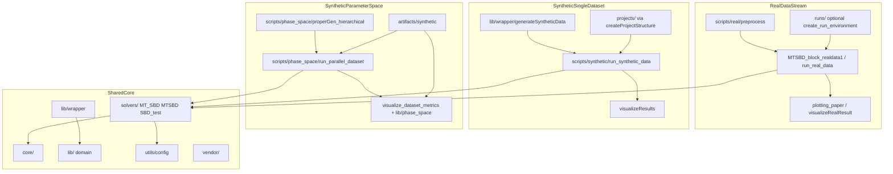

# Repository Structure DAG

Living DAG of functional streams and shared core.
Keep in sync with [`REPO_STRUCTURE.md`](REPO_STRUCTURE.md) and
[`../history/repo_reorg.md`](../history/repo_reorg.md).

## Functional streams

## Iteration status

| Iteration | Focus | Status |
|-----------|-------|--------|
| 0 | Inventory docs | Done |
| 1 | Soft retirement + config/path hygiene | Done |
| 2 | scripts regroup | Done |
| 3 | Artifact roots + real viz set | Done |
| 4 | solvers / vendor / lib rename | Done |
